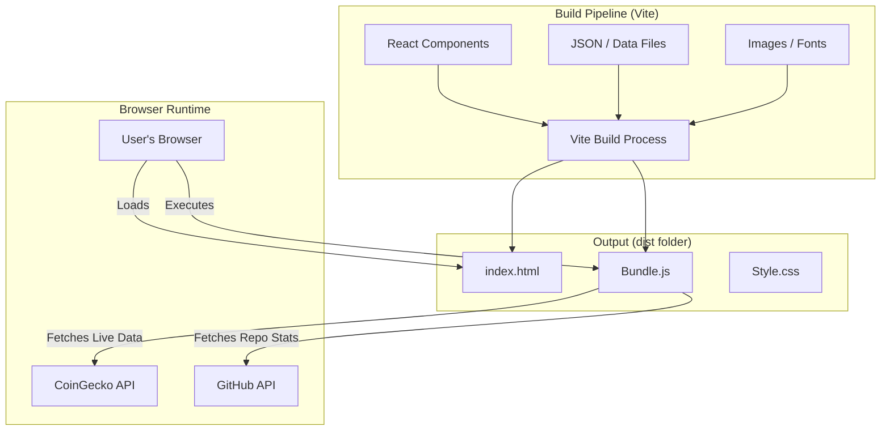

# 🍱 Bento Portfolio (Static Build)

> **Architecture**: Client-Side Static (SPA)
> **Build Tool**: Vite
> **Deploy**: GitHub Pages / Vercel / Netlify

## 📖 Overview

This is a **high-performance static website** showcasing a Full Stack Engineer's portfolio using the **Bento Grid** design pattern.

Unlike dynamic server-side apps, this project compiles entirely to static HTML/CSS/JS. It relies on **Client-Side Fetching** for "live" data (crypto prices, weather) and **Build-Time Generation** for content, ensuring maximum speed and zero server maintenance costs.

## 🏗 Architecture (Static)

### The "No-Backend" Strategy

Since we cannot run a Node.js server, we shift responsibilities:

* **Routing**: Handled client-side by `react-router-dom` (if multi-page) or a simple Scroll Spy (if single-page).
* **Data**: Fetched directly from public APIs via browser `fetch()` in `useEffect` hooks.
* **Content**: Stored as JSON files or Markdown within the repository, loaded at bundling time.

### System Diagram



## 🛠 Tech Stack

* **Core**: [React](https://react.dev) + [TypeScript](https://www.typescriptlang.org)
* **Build Tool**: [Vite](https://vitejs.dev) (Blazing fast, produces optimized static assets)
* **Styling**: [Tailwind CSS](https://tailwindcss.com)
* **Animations**: [Framer Motion](https://www.framer.com/motion/)
* **Icons**: [Lucide React](https://lucide.dev)
* **Routing**: [React Router](https://reactrouter.com) (Optional, if multiple pages are needed)

## 🧩 Tile Specifications (Static Adaptation)

### 1. The "Live" Stack Tile

* **Challenge**: No backend to scrape data.
* **Static Solution**: Use a public, rate-limit-friendly API.
* *Crypto*: Fetch ETH price via CoinGecko Public API (Client-side).
* *Code*: Fetch GitHub contributions via GitHub GraphQL API (using a read-only token).


### 2. The "Research" Tile

* **Challenge**: No database.
* **Static Solution**: A local `data/research.json` file.
```json
[
  {
    "id": "scraper-protocol",
    "title": "Verifiable Scraping with ZK Proofs",
    "summary": "Methodology for trustless data acquisition...",
    "link": "/pdfs/research-paper.pdf"
  }
]

```


* The component simply maps over this JSON array.


### 3. The "Contact" Tile

* **Challenge**: No server to process form POSTs.
* **Static Solution**: Use `mailto:` links or a static form handler service like **Formspree** or **Getform**.

## 🚀 Implementation Guide

### 1. Setup with Vite

Scaffold the project specifically for React/TypeScript.

```bash
npm create vite@latest portfolio -- --template react-ts
cd portfolio
npm install
npm install -D tailwindcss postcss autoprefixer
npx tailwindcss init -p
npm install framer-motion lucide-react clsx tailwind-merge

```

### 2. The "Bento" Component (`src/components/BentoGrid.tsx`)

A clean implementation using CSS Grid.

```tsx
import { ReactNode } from "react";
import { cn } from "../utils/cn"; // clsx helper

export const BentoGrid = ({ children, className }: { children: ReactNode; className?: string }) => {
  return (
    <div
      className={cn(
        "grid md:auto-rows-[18rem] grid-cols-1 md:grid-cols-3 gap-4 max-w-7xl mx-auto",
        className
      )}
    >
      {children}
    </div>
  );
};

export const BentoItem = ({
  className,
  children,
  header,
}: {
  className?: string;
  children?: ReactNode;
  header?: ReactNode;
}) => {
  return (
    <div
      className={cn(
        "row-span-1 rounded-xl group/bento hover:shadow-xl transition duration-200 shadow-input dark:shadow-none p-4 dark:bg-black dark:border-white/[0.2] bg-white border border-transparent justify-between flex flex-col space-y-4",
        className
      )}
    >
      {header}
      <div className="group-hover/bento:translate-x-2 transition duration-200">
        {children}
      </div>
    </div>
  );
};

```

### 3. Handling "Live" Data in Static React

Example of the Crypto Ticker tile using a client-side hook.

```tsx
// src/components/tiles/CryptoTile.tsx
import { useState, useEffect } from 'react';

export const CryptoTile = () => {
  const [price, setPrice] = useState<string>("Loading...");

  useEffect(() => {
    // Fetch directly from browser
    fetch('https://api.coingecko.com/api/v3/simple/price?ids=ethereum&vs_currencies=brl')
      .then(res => res.json())
      .then(data => setPrice(`R$ ${data.ethereum.brl}`))
      .catch(() => setPrice("Unavailable"));
  }, []);

  return (
    <div className="flex flex-col">
      <span className="text-sm text-neutral-400">ETH Price</span>
      <span className="text-2xl font-bold font-mono">{price}</span>
    </div>
  );
};

```

## 📦 Deployment (The Static Way)

Since there is no server, you build once and upload artifacts.

### Build Command

```bash
npm run build
# Creates a 'dist' folder containing:
#  - index.html
#  - assets/index-[hash].js
#  - assets/index-[hash].css

```

### GitHub Pages (Automated)

1. Push code to GitHub.
2. Go to **Settings > Pages**.
3. Set Source to **GitHub Actions**.
4. Use the "Static HTML" workflow.

## 🛡 Performance Tips for Static

* **Code Splitting**: Use `React.lazy()` for heavy tiles (like the Map or 3D elements) so the initial `index.html` load remains instant.
```tsx
const LazyMap = React.lazy(() => import('./MapTile'));

```


* **Asset Optimization**: Put large images in the `/public` folder and use modern formats (WebP) to keep the initial download size low.

## 📜 License

MIT